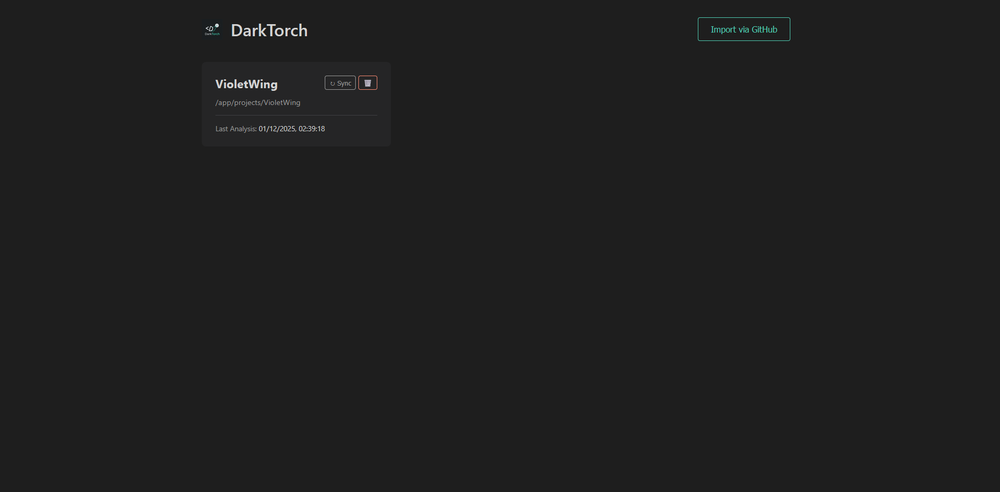

# DarkTorch: Code Visualization & Notes

DarkTorch is a powerful developer tool designed to bridge the gap between code structure and developer knowledge. It visualizes your Python project's dependency graph and allows you to attach persistent notes to specific files directly within the visualization.

## Key Features

- **Interactive Dependency Graph**: Automatically scans your Python project to build a visual graph of file dependencies using Cytoscape.js.
- **Project Management Dashboard**: Easily manage multiple projects. Import directly from GitHub (public or private), sync changes with a single click, and delete projects when done.
- **Integrated Note-Taking**: Click on any file node to open a dedicated panel where you can write and save notes. Notes are persisted in a SQLite database.
- **AI Code Helper**: Ask questions about your code directly in the interface. The built-in AI service (simulated) provides context-aware answers based on file content.
- **Dark Mode UI**: A sleek, developer-friendly dark theme inspired by modern IDEs.
- **Containerized Architecture**: Fully dockerized backend and frontend for consistent deployment.

## Screenshots

*Project Dashboard with GitHub Import and Sync*

*Interactive Dependency Graph Visualization*

## Technology Stack

- **Backend**: Python 3.11, FastAPI, SQLite
- **Frontend**: React, TypeScript, Cytoscape.js, Vite
- **Infrastructure**: Docker, Docker Compose, Nginx

## Quick Start

1. Clone the repository.
2. Run `docker-compose up --build`.
3. Open `http://localhost:80` to view the app.
